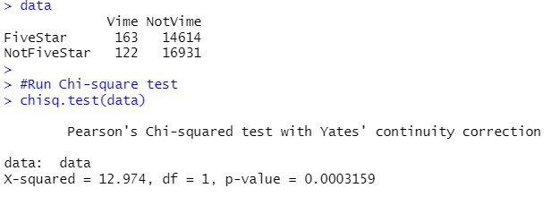

# Mod17_Challenge

## Overview

### Background
The company, SellBy, participates in an Amazon program in which they get access to a list of Amazon's Vime members for a small fee.  SellBy sends free products to select Amazon's Vime members in return for the members writing reviews on the Amazon site.  Questions have arisen as to the validity of the Vime members’ reviews.  There is a suspicion that reviews written by Vime are biased.  Our task is to analyze some data collected on Amazon reviews to determine if there is any bias in the data.

### Proposal

Available on one of Amazon's websites, there are 46 datasets for different specific product lines containing product review data.  Using the dataset for tools (https://s3.amazonaws.com/amazon-reviews-pds/tsv/amazon_reviews_us_Tools_v1_00.tsv.gz), we will limit the analysis to those reviews in which they have received at least 20 vote on helpfulness.  Since we are primarily concerned that there is a bias in the influential reviews, we will further limit our analysis to those reviews in which at least half of the votes viewed the review as helpful.

The primary analysis will be to determine if there is a larger percentage of 5-star reviews for Vime members as opposed to non-members.

## Results

In examining the dataset, we determined:
    -  there are more reviews by non-Vine members 31545 compared to Vime members 285.
    -  the number of 5-star reviews for non-Vine members is 14614 compared to Vime members 163
    -  the percentage of 5-star reviews for non-Vime members is lower 46.3% compared to Vime members 57.2%

## Summary

There is a bias towards positive reviews for the Vime members.  This can be explained by a psychology and economics concept, in which the value of a gift is not limited to the monetary cost of the gift.  The value of a gift is not limited to the monetary value in that elements of emotion are associated with a gift.  Gift-giving has been used for centuries to build better relationships and good feelings between the two entities.  This is especially true between nations in historical times (https://iset-pi.ge/en/blog/568-the-paradox-of-gifts-i-know-what-i-have-given-you-i-do-not-know-what-you-have-received-dr-sunwolf). 

Comparing the frequencies in R using a Chi-Square test shows that there is a significant difference between the two groups at the 0.001 level.

R code for chi-square test
https://www.phind.com/search?cache=336df0f4-21b6-422a-9633-a0d3f86d62f6

If SellBy's intention was to engender good feelings and positive reviews, then it has been successful.

